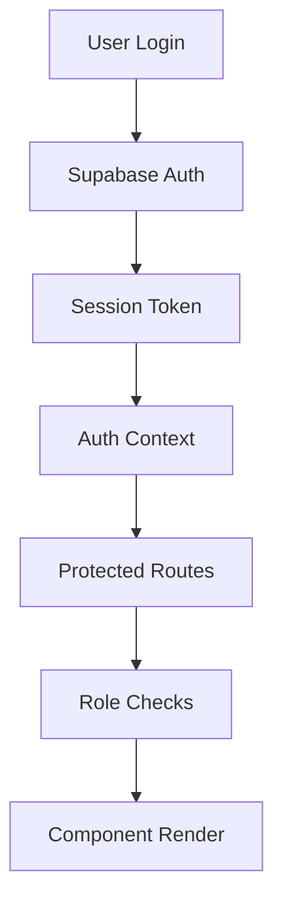
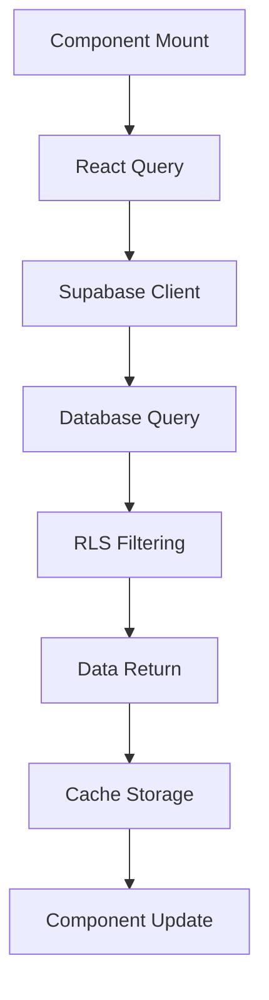
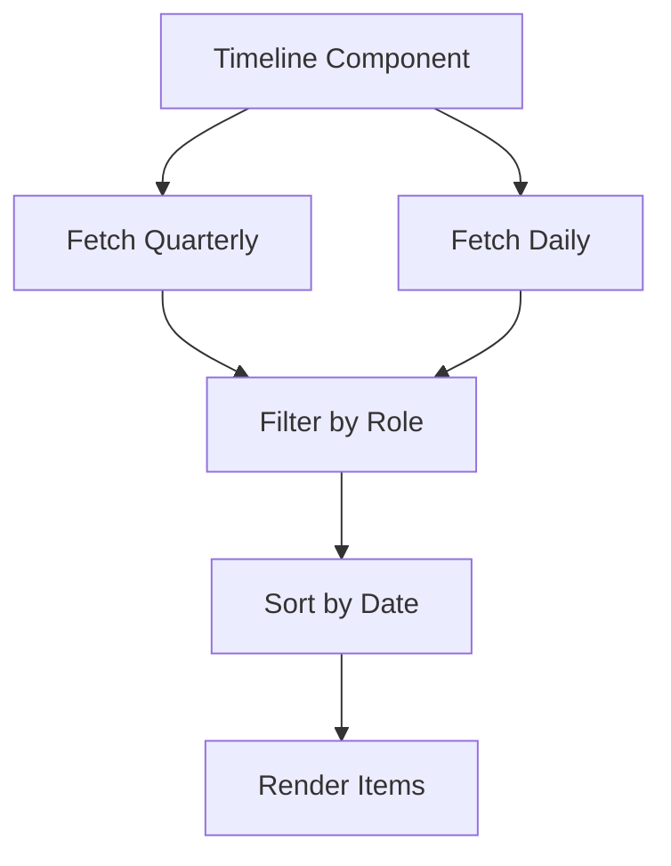

<!--
generated_by: tessera
source_sha: 939657ec2ede9cca1a4aad08f88592834464cc25
generated_at: 2026-04-16T12:21:14.215Z
action: create
-->

# Beudox HR - Architecture Documentation

## System Overview

Beudox HR is a comprehensive Human Resources Management System implemented as a modern single-page application (SPA) with a backend-as-a-service architecture.

## High-Level Architecture

```
┌─────────────────┐    ┌─────────────────┐    ┌─────────────────┐
│   React SPA     │    │    Supabase      │    │   PostgreSQL    │
│   (Frontend)    │◄──►│  Backend-as-a-  │◄──►│    Database     │
│                 │    │     Service      │    │                 │
└─────────────────┘    └─────────────────┘    └─────────────────┘
         │                       │                       │
         │                       │                       │
         ▼                       ▼                       ▼
┌─────────────────┐    ┌─────────────────┐    ┌─────────────────┐
│  React Router   │    │   Auth & RLS    │    │  Row Level      │
│   Navigation    │    │   Security      │    │   Security      │
└─────────────────┘    └─────────────────┘    └─────────────────┘
```

## Frontend Architecture

### Component Hierarchy

```
src/
├── App.tsx                 # Root component with providers
├── main.tsx               # Application entry point
├── pages/                 # Route-level components
│   ├── Dashboard.tsx
│   ├── Employees.tsx
│   ├── Settings.tsx
│   └── ...
├── components/
│   ├── ui/                # Base UI components (ShadCN)
│   ├── layout/            # Layout components
│   │   ├── AppLayout.tsx
│   │   ├── AppSidebar.tsx
│   │   └── TopBar.tsx
│   └── [feature]/         # Feature-specific components
│       ├── evaluations/
│       ├── leave/
│       └── ...
├── hooks/                 # Custom React hooks
├── lib/                   # Utilities and configurations
└── integrations/          # External service integrations
```

### State Management

#### Client State
- **React Context**: Authentication state (`useAuth`)
- **Local Component State**: UI state with `useState`
- **URL State**: Route parameters and query strings

#### Server State
- **React Query**: Data fetching, caching, and synchronization
- **Optimistic Updates**: Immediate UI feedback for mutations
- **Background Refetching**: Data freshness management

### Routing Architecture

#### Route Structure
```typescript
// Protected routes with role-based access
<Route path="/dashboard" element={<ProtectedRoute><Dashboard /></ProtectedRoute>} />
<Route path="/employees" element={<ProtectedRoute><Employees /></ProtectedRoute>} />
<Route path="/settings" element={<ProtectedRoute><Settings /></ProtectedRoute>} />
```

#### Route Protection
```typescript
const ProtectedRoute = ({ children }) => {
  // 1. Loading states
  // 2. Authentication checks
  // 3. Role-based authorization
  // 4. Render or redirect
};
```

## Backend Architecture (Supabase)

### Supabase Services

#### Authentication
- **Email/Password**: Standard authentication
- **Invite System**: Employee onboarding
- **Password Reset**: Recovery flows
- **Session Management**: Automatic token refresh

#### Database (PostgreSQL)
- **Tables**: Core business entities
- **Row Level Security**: Automatic data filtering
- **Real-time**: Live data subscriptions
- **Migrations**: Schema versioning

#### Storage
- **File Uploads**: Avatars, documents
- **Access Control**: Secure file permissions

#### Edge Functions
- **Server-side Logic**: PDF generation, email sending
- **Business Rules**: Complex calculations

### Database Schema

#### Core Tables
```sql
-- Employees
employees (
  id, full_name, email, role_name,
  department, avatar_url, hire_date
)

-- Evaluations
evaluations (
  id, employee_id, evaluator_id,
  period, overall_score, comments,
  recommendation, created_at
)

-- Daily Evaluations
daily_evaluations (
  id, reviewer_id, reviewee_id,
  direction, date, overall_score,
  remarks
)
```

## Data Flow Patterns

### Authentication Flow


### Data Fetching Flow


### Evaluation Timeline Flow


## Component Architecture

### Layout Components

#### AppLayout
```typescript
<AppLayout>
  <AppSidebar />  {/* Navigation */}
  <main>
    <TopBar />    {/* User menu, notifications */}
    <PageContent /> {/* Route content */}
  </main>
</AppLayout>
```

#### Component Communication
- **Props**: Parent-child data flow
- **Context**: Cross-component state (auth, theme)
- **Events**: User interactions
- **React Query**: Server state synchronization

### Key Component Patterns

#### SearchableEmployeeSelect
- **Composition**: Command + Popover + Button
- **State Management**: Local search state
- **Data Flow**: Props for data, callbacks for selection
- **Accessibility**: Keyboard navigation, ARIA labels

#### EvaluationTimeline
- **Data Aggregation**: Multiple queries unified
- **Conditional Rendering**: Role-based visibility
- **Performance**: Memoized filtering and sorting
- **Navigation**: React Router links

#### RichTextEditor
- **External Library**: TipTap integration
- **Controlled Component**: HTML state management
- **Toolbar**: Action buttons with state
- **Callbacks**: onChange for parent updates

## Security Architecture

### Authentication Security
- **Token-based**: JWT tokens with expiration
- **Secure Storage**: HttpOnly cookies where applicable
- **Automatic Refresh**: Seamless session management

### Authorization
- **Role-based Access Control**: CEO, HR Manager, Team Lead, Employee
- **Route Protection**: Component-level guards
- **API Security**: Row Level Security in database

### Data Protection
- **Input Validation**: Zod schemas on all inputs
- **SQL Injection Prevention**: Parameterized queries
- **File Security**: Type validation and size limits

## Performance Architecture

### Frontend Optimizations
- **Code Splitting**: Route-based lazy loading
- **Bundle Optimization**: Vite tree shaking
- **Image Optimization**: Proper sizing and formats
- **Caching**: React Query intelligent caching

### Database Optimizations
- **Indexing**: Optimized queries
- **Real-time**: Selective subscriptions
- **Pagination**: Large dataset handling
- **Connection Pooling**: Supabase managed

### Monitoring
- **Error Boundaries**: Graceful error handling
- **Loading States**: User feedback
- **Performance Metrics**: React DevTools profiling

## Deployment Architecture

### Build Process
```bash
Source Code → Vite Build → Static Assets → CDN
```

### Environment Configuration
- **Environment Variables**: Supabase credentials
- **Build-time Injection**: Vite env handling
- **Runtime Config**: Dynamic configuration

### Infrastructure
- **Static Hosting**: CDN for assets
- **API Gateway**: Supabase handles routing
- **Database**: Managed PostgreSQL
- **File Storage**: Supabase Storage

This architecture provides a scalable, secure, and maintainable foundation for the Beudox HR system, leveraging modern web technologies and best practices.