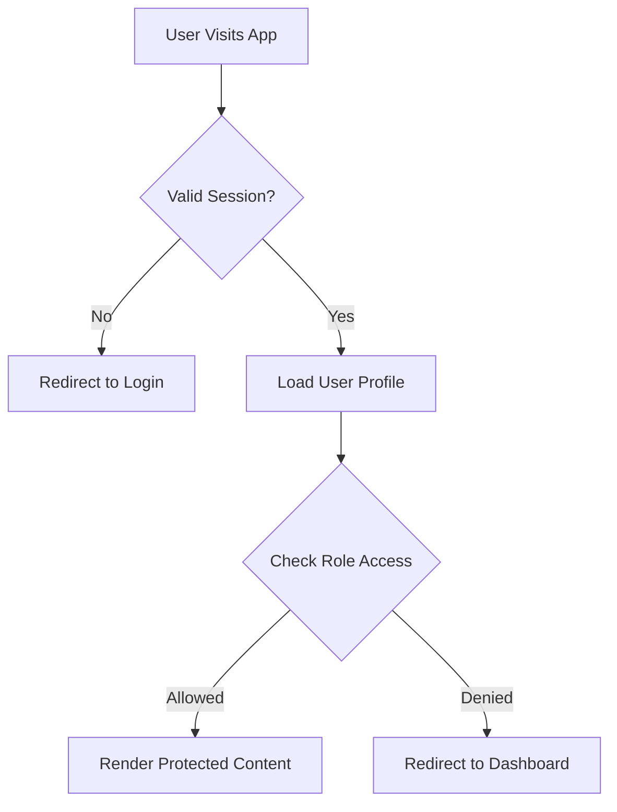
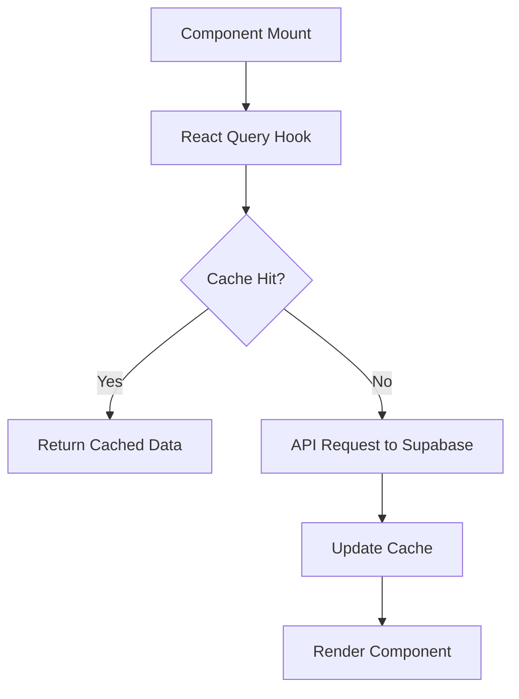
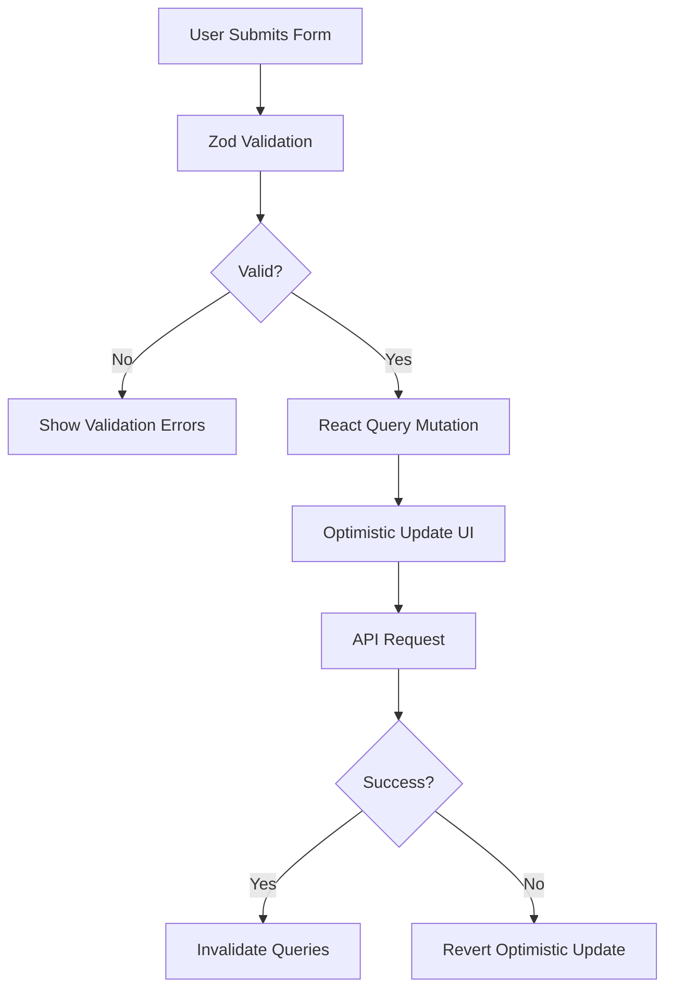

<!--
generated_by: tessera
source_sha: 1cec2ce393d8f182112788746e7935917c082ccd
generated_at: 2026-04-07T21:17:04.205Z
action: create
-->

# Beudox HR - Architecture Documentation

## System Overview

Beudox HR is a modern, full-stack HR management system built with React and Supabase. The application provides comprehensive workforce management capabilities with role-based access control and real-time features.

## Architecture Diagram

```
┌─────────────────┐    ┌─────────────────┐    ┌─────────────────┐
│   React SPA     │    │   Supabase      │    │   PostgreSQL    │
│   (Frontend)    │◄──►│   (Backend)     │◄──►│   (Database)    │
│                 │    │                 │    │                 │
│ • Components    │    │ • Auth          │    │ • Employees     │
│ • Pages         │    │ • Edge Functions│    │ • Evaluations   │
│ • Hooks         │    │ • Real-time     │    │ • Projects      │
│ • Utils         │    │ • Storage       │    │ • Payroll       │
└─────────────────┘    └─────────────────┘    └─────────────────┘
         │                       │                       │
         └───────────────────────┼───────────────────────┘
                                 │
                    ┌─────────────────┐
                    │   User Roles    │
                    │                 │
                    │ • CEO           │
                    │ • HR Manager    │
                    │ • Finance Mgr   │
                    │ • Team Lead     │
                    │ • Employee      │
                    └─────────────────┘
```

## Frontend Architecture

### Component Structure

```
src/
├── components/
│   ├── ui/           # shadcn/ui primitives (40+ components)
│   ├── layout/       # App layout components
│   │   ├── AppLayout.tsx
│   │   ├── AppSidebar.tsx
│   │   └── TopBar.tsx
│   └── [feature]/    # Feature-specific components
│       ├── evaluations/
│       ├── settings/
│       └── hr-policies/
├── pages/            # Route components
├── hooks/            # Custom React hooks
├── lib/              # Utilities and business logic
└── integrations/     # External service integrations
```

### State Management

#### Server State (React Query)
- API data caching and synchronization
- Optimistic updates for better UX
- Background refetching
- Error handling and retry logic

#### Client State (React Hooks)
- Component-local state
- Form state management
- UI interaction state

#### Authentication State
- Supabase session management
- User profile and role data
- Route protection logic

## Backend Architecture

### Supabase Services

#### Authentication
- User registration and login
- Password reset flows
- JWT token management
- Session handling

#### Database (PostgreSQL)
- Row Level Security (RLS) policies
- Real-time subscriptions
- Complex queries with joins
- Data validation and constraints

#### Edge Functions
- Business logic execution
- PDF generation (invoices, payslips)
- Email sending
- File processing

#### Storage
- File uploads (avatars, documents)
- Secure file access
- CDN delivery

## Data Flow Patterns

### Authentication Flow



### Data Fetching Flow



### Form Submission Flow



## Role-Based Access Control

### User Roles Hierarchy

```
CEO (Full Access)
├── HR Manager
│   ├── Employee Management
│   ├── Evaluations
│   ├── Policies
│   └── Settings
├── Finance Manager
│   ├── Payroll
│   ├── Invoices
│   └── Financial Reports
├── Team Lead
│   ├── Projects
│   ├── Team Evaluations
│   └── Basic Reporting
└── Employee
    ├── Personal Dashboard
    ├── Self-Evaluations
    └── Payslips
```

### Route Protection Logic

```typescript
// src/lib/role-access.ts
const roleRoutes = {
  employee: ['/dashboard', '/evaluations', '/my-payslip'],
  hr_manager: ['/employees', '/settings', '/evaluations'],
  finance_manager: ['/payroll', '/invoices', '/finance'],
  team_lead: ['/projects', '/evaluations'],
  ceo: ['*'] // Full access
};

function canAccess(role: string, path: string): boolean {
  // Check if role can access path
}
```

## Key Business Logic

### Evaluation System

#### Quarterly Evaluations
- Formal performance reviews
- Manager recommendations (HR/Managers only)
- Overall scoring (1-5 scale)
- Comments and feedback

#### Daily Evaluations
- Quick feedback mechanism
- Directional feedback (positive/constructive)
- Team lead and peer reviews
- Timeline aggregation

### Payroll Processing

```typescript
// Business logic in Supabase Edge Functions
interface PayrollCalculation {
  basicSalary: number;
  allowances: number;
  overtime: {
    regular: number;
    holiday: number;
  };
  deductions: number;
  netPay: number;
}
```

### PDF Generation
- Invoice PDFs with company branding
- Payslip generation
- Server-side rendering with custom fonts
- Secure document delivery

## Performance Optimizations

### Frontend Optimizations
- Code splitting by routes
- Lazy loading of components
- Image optimization
- Bundle analysis and tree shaking

### Backend Optimizations
- Database indexing
- Query optimization
- CDN for static assets
- Edge function caching

### Caching Strategy
- React Query for API responses
- Browser caching for static assets
- Service worker for offline capability

## Security Considerations

### Authentication Security
- JWT tokens with expiration
- Secure password policies
- Multi-factor authentication ready

### Data Security
- Row Level Security (RLS)
- Input validation and sanitization
- SQL injection prevention
- XSS protection

### API Security
- CORS configuration
- Rate limiting
- Request validation
- Error message sanitization

## Deployment Architecture

### Development Environment
- Local Vite dev server (port 8080)
- Hot module replacement
- Development database
- Debug logging

### Production Environment
- Static hosting (Vercel, Netlify, etc.)
- Production Supabase instance
- CDN distribution
- Error monitoring
- Performance monitoring

### CI/CD Pipeline
- Automated testing (unit + E2E)
- Build optimization
- Security scanning
- Deployment automation

## Monitoring & Observability

### Frontend Monitoring
- Error boundaries
- Performance metrics
- User interaction tracking
- Real user monitoring

### Backend Monitoring
- Database performance
- API response times
- Error logging
- Usage analytics

### Business Metrics
- User engagement
- Feature usage
- Conversion rates
- System reliability

This architecture provides a scalable, maintainable, and secure foundation for HR management operations.